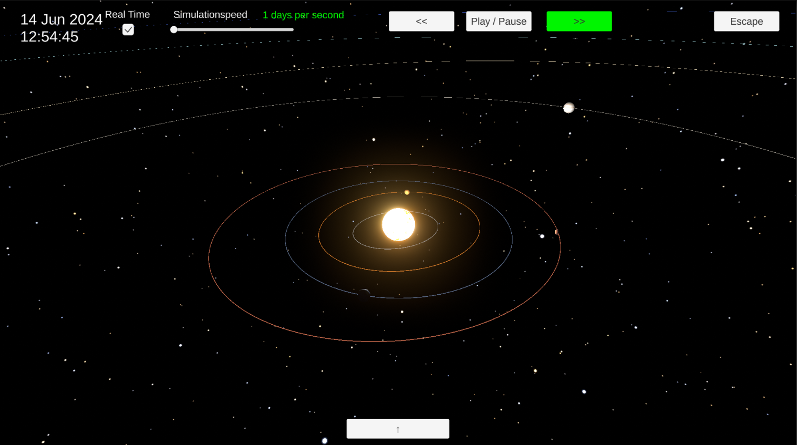

# Solar System Simulator

An interactive 3D simulation of our solar system built with Unity. Explore gravitational physics, add custom planets, and observe how celestial bodies influence each other over time.

  

## Features

- Realistic gravitational calculations between celestial bodies
- Add or remove planets to see their effect on the solar system
- Control simulation speed and travel through time
- Free camera movement to explore the system from any angle
- Sandbox mode for custom experimentation

## Getting Started

### Prerequisites

- [Unity Hub](https://unity.com) with **Unity Editor 2022.3.18f**

### Setup

1. Clone this repository
2. Open **Unity Hub** and click **Projects > Add**
3. Select the cloned project folder
4. Install the required Unity version if prompted
5. In the project, navigate to **Assets > Scenes** and open **MainMenuScene**
6. Press **Play** to start the simulation
